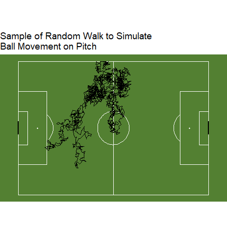
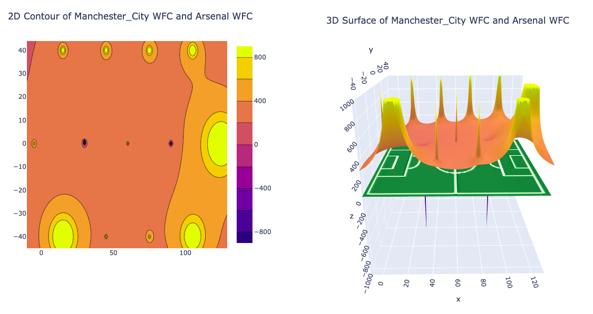
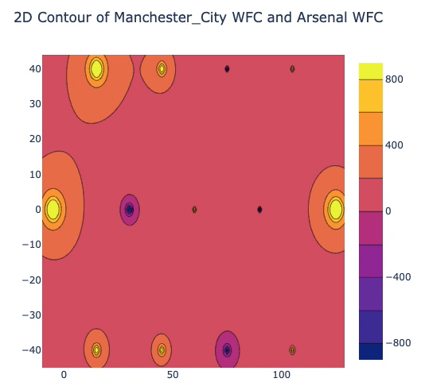
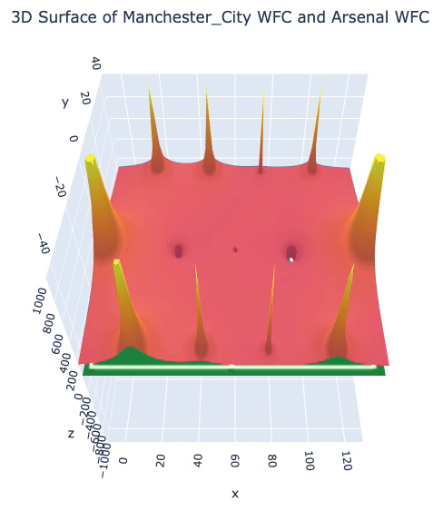
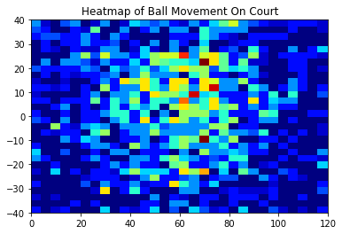
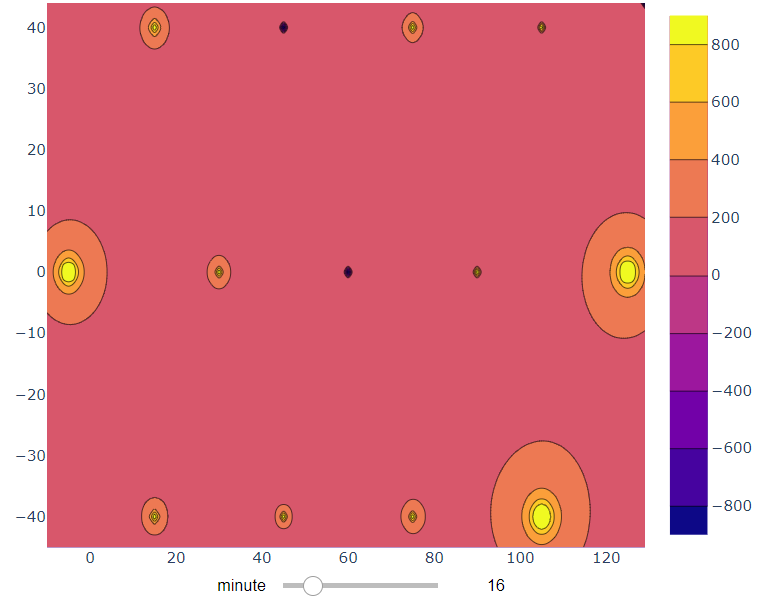
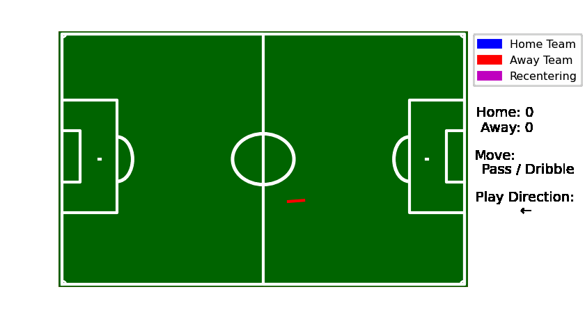

```{r setup, include=FALSE}
library(tidyverse)
library(SBpitch)
library("DiagrammeR")
options(htmltools.dir.version = FALSE)
knitr::opts_chunk$set(
  fig.width=9, fig.height=3.5, fig.retina=3,
  out.width = "100%",
  cache = FALSE,
  echo = TRUE,
  message = FALSE, 
  warning = FALSE,
  fig.show = TRUE,
  hiline = TRUE
)
```


```{r, include = FALSE}
all_scores <- readRDS("data/all_scores.rds")
poisson_baseline <- readRDS("data/poisson_scores.rds")
mean_baseline <- readRDS("data/mean_baseline.rds")
sifan_predata <- readRDS("data/sifan_predata")
```


<!-- Nick -->
## Introduction / Motivation

- Model ball movement dynamics with tracking data of only the ball (and not other players)

- To encapsulate the complex movement and forces acting on the ball into a much simpler, useful object

- A potential function is just an equation that model underlying forces

- Use this to approximate final game outcomes


---
<!-- Sifan  -->
## [StasbombR Data](https://github.com/statsbomb/StatsBombR)
```{r, echo=F}
# DT::datatable(head(sifan_predata), fillContainer = FALSE, options = list(pageLength = 6))
knitr::kable(head(sifan_predata), format = 'html')
```

#### Data provided by [Statsbomb](https://github.com/statsbomb/open-data)


---
<!-- Sifan 1-->
## Random Walk

A sequence of some steps in random directions on some mathematical space.

- A point randomly moves along the integer line

- A point randomly moves on x-y plane

--

<center>

---
<!-- Sifan 2-->
## Potential Function

- Idea: The ball is a randomly drifting ball that is attracted to the goal by some "force". 

--

- We can try to model this underlying force based on the movements of the ball

--

- Our Potential Functions
  - Gravity

$$ V(x,y) = -\frac{G}{\sqrt{x^2 + y^2}} $$

---
## Random Walk under Harmonic Potential Function
Using potential function as a guidance for random walk

--

- A step by the random particle under a force.
$$r(t_{i+1}) - r(t_i) = - \nabla V(r(t_i)) (t_{t+1} - t_i) + \sigma \sqrt{(t_{i+1} - t_i)} Z_{i+1}$$

--
<br>

- Small_Change = Estimated_Velocity x TimeStep + Noise 


<!-- END OF SIFAN SLIDES -->

---
<!-- Nick  -->
## Learning Potential Functions from Trajectories

- [Learning a Potential Function from a Trajectory -  Brillinger](https://statistics.berkeley.edu/sites/default/files/tech-reports/723.pdf)

- Assumptions

--

  - Overdamped system, so force affects the velocity, not acceleration.
  - $V(x,y)$ can be approximated as a linear combination of basis functions
  
  
---

## The Basis Functions

- Our basis functions are a set of gravitational points on the field

- The Coefficients Scale the strength of the hole (Attractive or Repulsive)

$$V(x_i,y_i) = \sum - \frac{\beta_i}{\sqrt{(x-x_i)^2 + (y-y_i)^2}} $$




---

## Overview of the Potential Fitting Model

$$V(x,y) = \phi(x,y)^T \beta$$
$$Force = -\nabla V(x,y) = -\nabla \phi(x,y)^T \beta$$

--
$$Velocity \sim Force$$
--
$$\frac{dr}{dt} = - \nabla V(x,y)$$


---

<!-- Nick  -->
## Learning Potential Functions from Trajectories

```{r, echo = FALSE, fig.height=5}
DiagrammeR::grViz("digraph {
graph [layout = dot, rankdir = TB]
# define the global styles of the nodes. We can override these in box if we wish
node [shape = rectangle, style = filled, fillcolor = Linen]
StatBomb [label = 'StatBombR', shape = folder, fillcolor = Beige]
data1 [label = 'Teams Offensive \n Trajectories', shape = folder, fillcolor = Beige]
data2 [label = 'Teams Defensive \n Trajectories', shape = folder, fillcolor = Beige]
fit_function [label =  'Fit Potential \n Function Model']
off_coef [label = 'Teams Offensive \n Coefficients', shape = folder, fillcolor = Beige]
def_coef [label = 'Teams Defensive \n Coefficients', shape = folder, fillcolor = Beige]
# edge definitions with the node IDs
StatBomb -> {data1 data2}  -> fit_function -> {off_coef, def_coef}
}")
```


---
<!-- Nick  -->
## Simulating Games using the learned Potential Functions

- Overlay the potential coefficients (additive) and simulating

```{r, echo = FALSE, fig.height=5}
DiagrammeR::grViz("digraph {
graph [layout = dot, rankdir = LR]
# define the global styles of the nodes. We can override these in box if we wish
node [shape = rectangle, style = filled, fillcolor = Linen]
StatBomb [label = 'StatBombR match \n data', shape = folder, fillcolor = Beige]
OverlayCoef [label =  'Overlay \n Coefficients']
SimGame [label =  'Simulate Game \n Model']
Game_Avg_Pred [label =  'Averaged Score \n Prediction']
off_coef [label = 'Teams Offensive \n Coefficients', shape = folder, fillcolor = Beige]
def_coef [label = 'Teams Defensive \n Coefficient', shape = folder, fillcolor = Beige]
# edge definitions with the node IDs
{off_coef, def_coef,StatBomb }  -> OverlayCoef -> SimGame -> SimGame -> Game_Avg_Pred
}")
```


---

## Potential Surface Contour

- Contour Map of Arsenal's Defensive and Manchester's Offensive
- Showing the maps change over time
```{r out.width='70%', echo = FALSE, fig.align='center'}

```

---

## 3D Potential Function

- Contour Map of Arsenal's Defensive and Manchester's Offensive
- Showing the maps change over time
```{r out.width='70%', echo = FALSE, fig.align='center'}

```

---
## Simulating the Game with the changing 

.pull-left[

- Heatmap of the simulated Game Trajectory

]

.pull-right[
```{r out.width='100%', echo = FALSE, fig.align='right'}

```
]

---
<!-- Adhvaith and Nick-->

## Simulated Game Gif

.pull-left[
- Manchester City WFC (Home) vs Arsenal WFC (Away)
- Score at Minute 17
]

.pull-right[

]
```{r out.width='80%', echo = FALSE, fig.width = 5}

```


---
<!-- Adhvaith and Nick-->
## Other Baseline Comparisons

- Average has an MSE of 3.597692

- Fails to capture higher score differentials


```{r, echo = FALSE, fig.height=5}
mean_baseline %>% 
  mutate(pred_score_diff = (baseline_home - baseline_away), actual_score_diff = (home_actual_score - away_actual_score))  %>% 
  group_by(match_id) %>% 
  summarize(pred_score_diff = mean(pred_score_diff), true_score_diff = mean(actual_score_diff)) %>% 
  mutate(residue = true_score_diff - pred_score_diff) %>% 
  ggplot() +
  geom_point(aes(y=true_score_diff, x=pred_score_diff), alpha = 0.7) +
  geom_abline(intercept = 0, slope = 1, linetype = "dashed", color = "red") + 
  labs(title = "Average Score Baseline fails to capture higher score differentials") + 
  scale_y_continuous(breaks = seq(-5, 5,
                                  by = 1)) +
    scale_x_continuous(breaks = seq(-10, 10,
                                  by = 1))  +
  geom_hline(yintercept=0, linetype="solid", color = "blue") +
  geom_vline(xintercept=0,  linetype="solid", color = "blue") +
  coord_fixed(x = c(-5, 5), y = c(-5,5)) +
  xlab("Predicted Score Differential") + ylab("True Score Differential")
```

---
## Other Baselines and Our Results


- Poisson has an MSE of 3.607477

- Categorical GLM fit with Poisson Family, covariates are home, team and opponent.

```{r, echo = FALSE, fig.height=5}
poisson_baseline %>% 
  mutate(pred_score_diff = (home_pred - away_pred), actual_score_diff = (home_actual_score - away_actual_score))  %>% 
  group_by(match_id) %>% 
  summarize(pred_score_diff = mean(pred_score_diff), true_score_diff = mean(actual_score_diff)) %>% 
  mutate(residue = true_score_diff - pred_score_diff) %>% 
  ggplot() +
  geom_point(aes(y=true_score_diff, x=pred_score_diff), alpha = 0.3) +
  geom_abline(intercept = 0, slope = 1, linetype = "dashed", color = "red") + 
  labs(title = "Poisson Baseline can predict larger differentials but has error") + 
  scale_y_continuous(breaks = seq(-5, 5,
                                  by = 1)) +
    scale_x_continuous(breaks = seq(-10, 10,
                                  by = 1))  +
  geom_hline(yintercept=0, linetype="solid", color = "blue") +
  geom_vline(xintercept=0,  linetype="solid", color = "blue") +
  coord_fixed(x = c(-5, 5), y = c(-5,5)) +
  xlab("Predicted Score Differential") + ylab("True Score Differential")
```

---
## Other Baselines and Our Results

- Our model MSE = 3.379572 after 200 sims per game

- Arrives at the same conclusions as models trained exclusively on the data. 

```{r, echo = FALSE, fig.height=5}
all_scores %>% 
  group_by(match_id) %>% 
  summarize(pred_score_diff = mean(pred_score_diff), true_score_diff = mean(actual_score_diff)) %>% 
  mutate(residue = true_score_diff - pred_score_diff) %>% 
  ggplot() +
  geom_point(aes(y=true_score_diff, x=pred_score_diff), alpha = 0.7) +
  geom_abline(intercept = 0, slope = 1, linetype = "dashed", color = "red") + 
  labs(title = "Potential Model Captures higher score differentials well \n and has slightly lower error than poisson") + 
  scale_y_continuous(breaks = seq(-5, 5,
                                  by = 1)) +
    scale_x_continuous(breaks = seq(-10, 10,
                                  by = 1))  +
  geom_hline(yintercept=0, linetype="solid", color = "blue") +
  geom_vline(xintercept=0,  linetype="solid", color = "blue") +
  coord_fixed(x = c(-5, 5), y = c(-5,5)) +
  xlab("Predicted Score Differential") + ylab("True Score Differential")
```


---
<!-- Nick -->
## Discussion and Future Work

- A proof of concept that potential functions can capture team dynamics, as can be seen by the score predictions.

- Lots of potential to improve the framework with more accurate sub-models

  - Shot Decision model and Goal Decision model
  
  - Incorporate team formation and score differential into the potential function
  
- This framework can be used to determine other things such as:

  - Player-based potential functions to determine player impacts
  
  - Real-Time Game Evaluation 


---
<!-- Nick -->

## Appendix: Game Simulation

```{r, echo = FALSE, fig.height=7}
DiagrammeR::grViz("digraph {
graph [layout = dot, rankdir = TB]
# define the global styles of the nodes. We can override these in box if we wish
node [shape = rectangle, style = filled, fillcolor = Linen]
Start_Game [label = 'Start Game']
startPoss [label =  '50-50 Determine \n Possession']
RandStep [label =  'Random Walk Step \n Under Potential']
Bound [label =  'Boundary Checks']
Goalbounds [label =  'Close to goal?']
shot [label =  'Decides to Shoot']
noshot [label =  'Decides to NOT Shoot']
goal [label =  'Decides to Shoot']
score [label =  'SCORE']
miss [label =  'Miss']
update_score [label =  'Update Score']
update_time [label =  'Update time']
# edge definitions with the node IDs
Start_Game -> startPoss -> RandStep -> Bound -> Goalbounds
Goalbounds -> RandStep
Goalbounds -> shot
shot -> goal -> score -> update_score -> update_time -> startPoss
goal -> miss -> update_time -> RandStep
Goalbounds -> noshot -> update_time -> RandStep
}")
```
